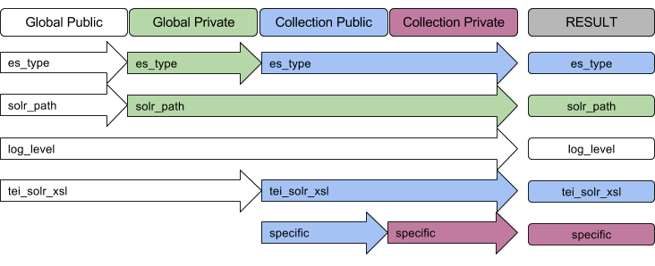

## Configuration

### Quick Start

Open up the `config/public.yml` file in your new collection and add or change the following.  Change them in the appropriate environment's tab inset (development, production) if they will need to be different based on environment.

```yaml
default:
  collection:
  es_index:
  es_path:
  es_user:
  es_password:
  api_version:
```
(The options es_user and es_password are needed if you are using a secured Elasticsearch index.) api_version is required with the new API schema, please specify "2.0", or "1.0" if using with a legacy repository that uses the old fields.

If there are any settings which must be different based on the local environment (your computer vs the server), place these in `config/private.yml`.

To see all the options for a specific environment, run:

```
print_options -e [environment]
```

Reasons why you might need to customize more stuff:

- you need a custom XSL script for HTML or Solr
- you have multiple environments with varying requirements
- you need to override default settings from datura

Read on if you would like to understand more about how the configuration files interact, if you need to add anything which should NOT be committed to version control, or if you just want to see some of the more common options.

If you are using Solr, you may need to specify an overriding XSL stylesheet.

Otherwise, continue to [preparing your index](prepare_index.md).

### Environments

Each config file is only required to have a "default" environment. Typically, the config file may also have "development" and "production", but you may add as many environments as you like with any names.

```
default:
  ...
development:
  ...
production:
  ...
jessica_test:
  ...
```

When you run a script, whether it be to clear an index or post files, you may pass it an environment.  If no environment is specified, it will attempt to use the `development` environment.  Anything NOT specified in a given environment will use the default environment's settings.

For example:

```
default:
  es_path: main_dev_server
production:
  es_path: localhost:9200
```

In the above example, if you run `post -e production` the `es_path` will be `localhost:9200`, but all over environments would use `main_dev_server`, including when the specified environment does not exist.

### Inheritance

When it comes to clearing and posting to an index, there are three configuration files which you must be aware of.

- datura public (ships with the datura gem)
- collection public `config/public.yml`
- collection private `config/private.yml` (optional)

**The most specific instance of a key will be used. That is, the keys inherit in the above order, waterfall style**

For example, if global public has key `solr_path: dev1.unl.edu` but your collection's private config has `solr_path: project.unl.edu`, the solr path used will be `project.unl.edu`



### Common Options

#### XSL Scripts

`tei_solr_xsl`: XSL which overrides the generic script to convert TEI XML to a solr format.  There are several variations on this theme:

```
tei_solr_xsl, vra_solr_xsl, dc_solr_xsl, csv_solr_xsl
tei_html_xsl, vra_html_xsl, dc_html_xsl, csv_html_xsl
```

Note that the above are not required for Elasticsearch, and are in fact only required for XSL specific transformations such as converting to Solr and HTML.  You can pass specific parameters into the XSL scripts with the following configuration options:

```yaml
variables_html:
  fig_location:
  site_url:
variables_solr:
  collection:
  fig_location:
  file_location:
  site_url:
  slug:
```

These are used to pass information into the XSL scripts.  You may add any additional ones which you would like directly in your collection's configuration file.  Copy them into different environments if you need different URLs for development than production, etc.

#### private.yml

Things in `private.yml` always override things in `public.yml` and also are NOT committed to version control. This means two things:

- you can keep them out of the public eye
- easier to run the same environment from two places

Speaking to the first point, you may, for example, not want your solr_path endpoint available in github:

`solr_path: http://your_server:8080/solr`

Also, you may want to run something on localhost from your computer, but point it at a specific URL when running it from a shared server.  Rather than creating a whole new environment or having to manually change the URL each time, if the variable is defined in `private.yml` you shouldn't have to mess with it.

Some stuff commonly in `private.yml`:

- `threads: 5` (5 recommended for PC, 50 for powerful servers)
- `es_path: http://localhost:9200`
- `es_index: some_index`
- `es_user: elastic` (if you want to use security on your local elasticsearch instance)
- `es_password: ******`
- `solr_path: http://localhost:8983/solr`
- `solr_core: collection_name`

#### Next

You're all set!  `print_options` again to make sure things look okay and then continue to [preparing your index](prepare_index.md).
