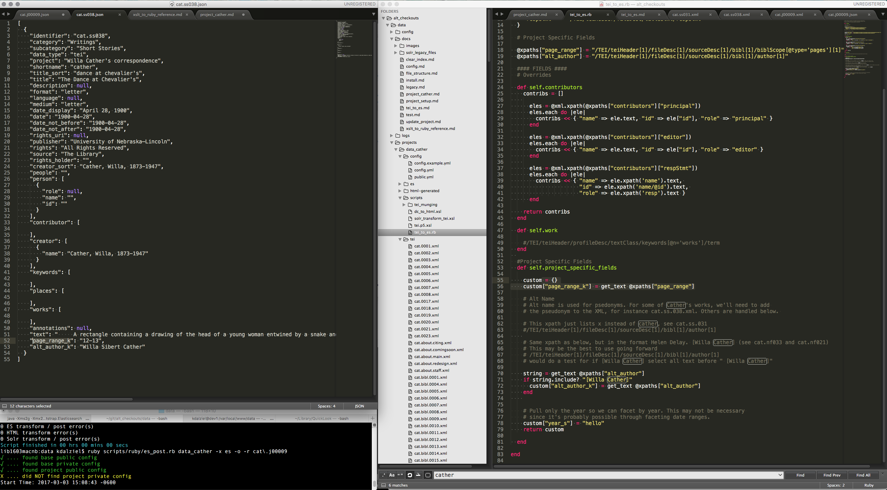

# Cather Archive index update and HTML generation instructions

## Locations

### Temporary Rosie Dev instructions

Once everything is set up, you should use cathersites for populating the index, until then, follow these temporary instructions. 

Log into the server.

```
ssh YOUR_USER@cdrhdev1.unl.edu
 ```

Change directory to the data repo:

```
cd /var/local/www/data/
```

At this point, you can follow the directions in the next section, "pulling git updates."

### Cathersites

You will run all update scripts from cathersites. 

```
ssh YOUR_USER@cathersites.unl.edu
```
```
cd /var/local/www/data/
```

## Pulling Git Updates

If you have made any changes to files on your computer, you'll need to pull them to the server. 

Change directories to your collection folder

```
cd collections/complete-letters
```

(where complete-letters is the folder containing the data repo you want to update)

```
git status
```

If all is clear, run

```
git pull
```

## Populating the index and generating HTML

In order to populate the TEI you just pulled, change directories back to your data directory (here, going up two directories): 

```
cd ../..
```

This will put you back at the data repo folder. From there, you can run the update scripts. Full documentation of running the scripts is found in [update_collection.md](update_collection.md) and for clearing the index in [clear_index.md](clear_index.md), but I'll spell out a few commands you'll run frequently below.

### Posting Documents

To post all the documents in one data repo, run: 

```
ruby scripts/ruby/post.rb complete-letters -e development -x es
```

to find out the options for this script run it with a -h flag. More documentation here: [update_collection.md](update_collection.md)

### Producing HTML

The above command only posts the data to the index. If you'd like to run the HTML in addition, you can remove the -x es

```
ruby scripts/ruby/post.rb complete-letters -e development
```

In the development version, I plan on using cocoon to generate the HTML, so this should only be necessary for production. 

(Note, I have not set this up yet, change instructions if we do not use cocoon) -KMD

### Clearing Documents

To clear *all* the cather docs, run: 

```
ruby scripts/ruby/es_clear_index.rb complete-letters -e development
```

(development is the environment, and is what you should use until the site is ready to go live)

Note that this will clear the entire index, though!

If you only want to clear one file or a set of files you can run 

```ruby 
scripts/ruby/es_clear_index.rb complete-letters -r cat.let0001 -e development
```

To clear all files that start with the string provided. For more options, see the [clear_index.md](clear_index.md) doc. 

## Adding things to/changing the index

Your first step, if you have not already, is to read the [Customizing tei_to_es.rb](tei_to_es.rb) document.

Then you'll need to set up your development environment so you can check your changes. (See next section)

After this is set up, you can add fields to the index. 

The command I use to transform a single file into JSON so I can check my work looks like this: 

```
ruby scripts/ruby/post.rb complete-letters -e development -x es -o -r cat\.j00009 -t
```

- -e = setting the development environemnt (this is the default, so can usually be omitted)
- -x es = tells the script we're using the elasticsearch scripts
- -o = tells the script to store output int he "es" folder. these are for debugging only, and won't commit back to the repo. 
- -r = regex to specify which file(s) to transform. While I am working through issues, I'll stick to running

## Setting up a development environment

In order to make the changes mentioned above, you'll need to be able to set up a dev environment that will allow you to easily make changes and see them reflected in generated files. Some thoughts are below. 

First, you'll need to decide on local development vs working on the server. If you want to work on the server, locally mounting the disk is the only way I know of to make it seamless enough. I recommend using the software [Panic's "Transmit"](https://panic.com/transmit/) to do this - it's an FTP program, but gives you the option to remotely mount a folder and interact as if it existed locally. It's also a good, stable FTP program. 

### Getting everything installed

Alternately, you can set your environmet up locally and run it. A loose description is below, but refer to a dev team member to help you get everything set up in the correct spot. The following instructions are for OSX, if we encounter windows users we'll need to figure it out!

1. Install RVM on your mac. https://rvm.io/
    - This will allow you to have several different versions of ruby running on your computer and keep up with the version set for our data collections.
2. Download the data git repo: https://github.com/CDRH/data
    - currently, this needs to be set to the "es" branch
3. Download the data_cather repos into data/collections
4. cd into the data repo from a terminal. When RVM is installed, this will set the correct Ruby version. If you don't have that verison installed, it will prompt you to install the correct version. 
5. run "bundle install" to install the code needed to run the data repo. 

### Run on your computer

I have modeled my approach on Oxygen's XSLT debugger mode, which looks like this:


my new set up looks something like this, and it consists of a text editor with two windows open and a terminal window:



I make changes in the window with the ruby files, tab over to my terminal window, hit the up key to retreive the last command, and it changes the JSON view so I can check if my changes were correct. Alternately, it may spit out an error. 


 a file at a time, but after a while you may want to omit this and check a bunch of output at once. 

